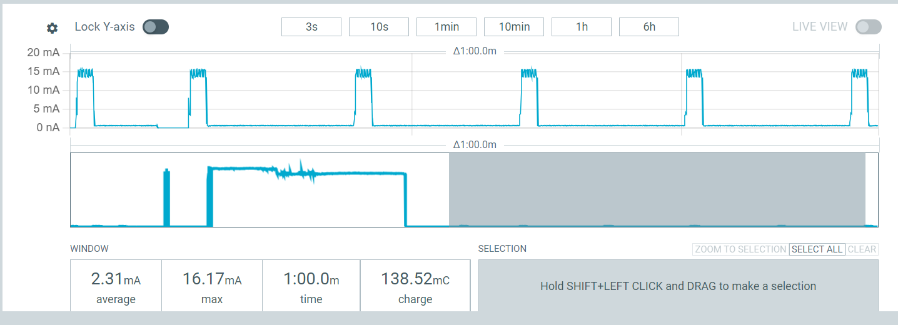

# Powman – Power Management Library for TinyGo

The main goal is to reproduce similar low-power timer and wake-up functionalities in TinyGo. It provides direct access to hardware registers through memory-mapped I/O and is intended for **bare-metal embedded development**.

This project is inspired by and based on the **powman library** implementation available in the [**Raspberry Pi Pico SDK**](https://github.com/raspberrypi/pico-sdk/tree/master) 

The library directly accesses the RP2350 power management and timer registers via memory-mapped I/O. Official documentation can be found in the [**RP2350 datasheet**](https://pip-assets.raspberrypi.com/categories/1214-rp2350/documents/RP-008373-DS-2-rp2350-datasheet.pdf?disposition=inline), especially in Section **6.0** (Power Management Overview and Section **6.4** (Register Configuration)

Powman is a low-level power management library for TinyGo, designed to control low-power modes, timers, and wake-up alarms on ARM-based microcontrollers.

> [Here](https://github.com/PippoZord/micropython-powman) for the same micropython implementation

## Requirements

* TinyGo
* Raspberry Pi Pico 2

## Usage

### Initialize the Timer

Set the absolute system time in milliseconds:

```go
powman.PowmanInit(1704067200000)
```

---

### Enter Low-Power Mode for a Duration

Put the system to sleep and wake it up after a given time:

```go
powman.PowmanOffForMs(10000) // Sleep for 10 seconds
```

---

### Typical Example

In `main.go` there is an example that uses the Powman functions. The device blinks the internal LED and then enters low-power mode for 10 seconds.

The build directory contains `powman.uf2` which executes the example application

Power consumption over one minute.


## Results




The consumption during low power mode


## How It Works

Powman directly accesses memory-mapped registers to control:

* System timer
* Alarm registers
* Power regulator
* Boot configuration
* Interrupt enable flags

The library uses `unsafe.Pointer` internally to read and write hardware registers.

This is required for bare-metal development and is safe in this context.

---

##  Main Functions

### `PowmanInit(absTimeMs uint64)`

Initializes the internal timer using an absolute timestamp.

---

### `PowmanOffForMs(sleepingMs uint64)`

Puts the system in deep sleep mode and schedules a wake-up alarm.


## Future Developments

- Support for waking up from low-power mode via GPIO interrupts.

## Safety Notes

* This library bypasses Go memory safety using `unsafe`.
* Only use in embedded/bare-metal environments.
* Incorrect register values may brick your device.


## Supported Platforms

Tested primarily on:

* Raspberry Pi Pico 2
